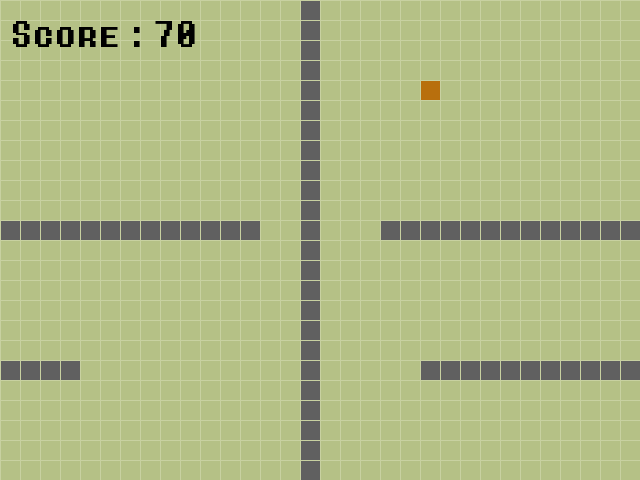

# Snake Game


Un jeu de Snake simple réalisé en Python avec Pygame et généré par le bot Marv.

## Table des matières

- [Prérequis](#prérequis)
- [Installation](#installation)
- [Utilisation](#utilisation)
- [Captures d'écran](#captures-décran)
- [Licence](#licence)

## Prérequis

Avant de pouvoir jouer à ce jeu, assurez-vous d'avoir installé Python et la bibliothèque Pygame sur votre système.

### Installation de Python

Vous pouvez télécharger Python depuis le site officiel : [python.org](https://www.python.org/downloads/)

### Installation de Pygame

Pour installer Pygame, ouvrez votre terminal/commande et exécutez la commande suivante :

```bash
pip install pygame
```

## Installation

```bash
git clone https://github.com/Bit-Scripts/SnakeGame.git #Clonez ce dépôt sur votre ordinateur
cd SnakeGame #Accédez au répertoire du jeu
python main.py #Lancez le jeu en utilisant Python
```

## Utilisation

Utilisez les touches directionnelles (haut, bas, gauche, droite) pour contrôler le serpent.
Mangez les pommes pour gagner des points et faire grandir le serpent.
Évitez de vous cogner dans le corps du serpent.


## Captures d'écran

  
  
  
  
  

## Licence
  
Ce jeu est distribué sous la [licence GPL-2.0](LICENSE.md). Consultez le fichier [License.md](LICENSE.md) pour plus de détails.

La police de caractères "digital_font.ttf" est sous licence GPLv3.0.

Le fichier "scores.txt" est utilisé pour stocker les meilleurs scores du jeu.